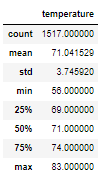

# Surfs Up
## Overview of Analysis
### Purpose
The purpose of this analysis was to generate data for the weather in June and December in Oahu, Hawaii, to see if opening up and surf and ice cream shop business is sustainable-year round. The analysis is created by using Python and SQLAlchemy. 

## Results
### Three Key Differences in Weather between June and December
1. June had 1,700 days of weather data to pull from, the average temperature was 74.94 degrees, the maximum was 85 and the minimum was 64.

2. December had 1,517 days of weather data to pull from, the average temperate was 71 degrees, the maximum was 83 and  the minimum was 56.
 
3. 
## Summary 
An additional, query that could be done to gather more information, is to add the recepitation analysis with the temperature analysis. Possibly even look into extreme weather patterns like snow. This will help provide context as to if a day is warm but still had thunderstorms, or it was warm and sunny. 
