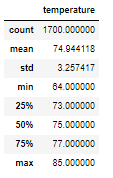

# Surfs Up
## Overview of Analysis
### Purpose
The purpose of this analysis was to generate data for the weather in June and December in Oahu, Hawaii, to see if opening up and surf and ice cream shop business is sustainable-year round. The analysis is created by using Python and SQLAlchemy. 

## Results
### Three Key Differences in Weather between June and December
1. June had 1,700 days of weather data to pull from, the average temperature was 74.94 degrees, the maximum was 85 and the minimum was 64.

2. December had 1,517 days of weather data to pull from, the average temperate was 71 degrees, the maximum was 83 and  the minimum was 56.

 

3. Overall, June had the higher temperatures, but December was not that far behind with the average and maximum temperatures. However, the minimum temperatures varied by almost 10 degrees having the largest variance. With a minimum temperature of 56, it can be said that those are not the best temperatures for either surfing or ice cream. 

## Summary 
Oevrall the weather in June and December have been historically very similar, although December has a wider range of results, it does make a case that a yearlong surf and ice cream shop could work with the temperatures provided. 

An additional, query that could be done to gather more information, is to add the recepitation analysis with the temperature analysis. Possibly even look into extreme weather patterns like snow. Lastly, we could look to see the sunny versus cloudy days to help paint the full picture of the weather in Oahu. This will help provide context as to if a day is warm but still had thunderstorms, or it was warm and sunny. Lastly, we could narrow our search for stations to get the weather that is closest to our potential shop.
